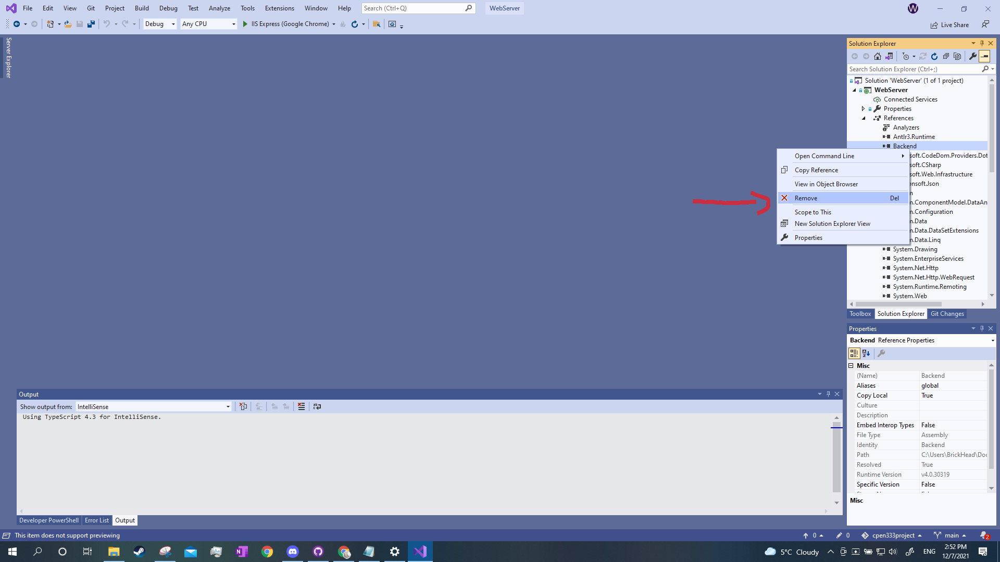
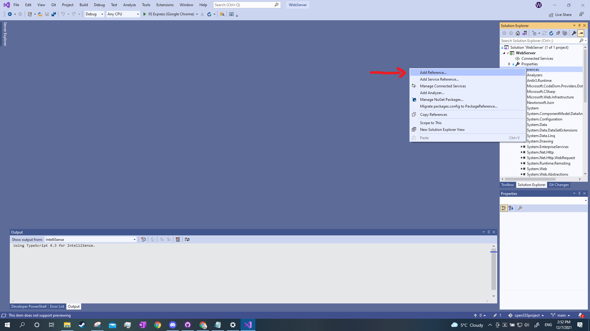
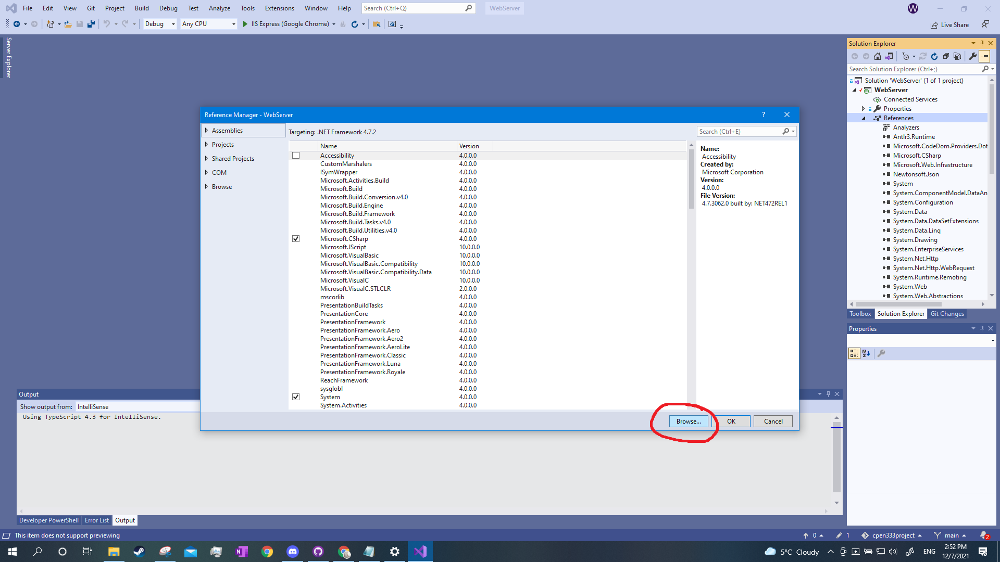
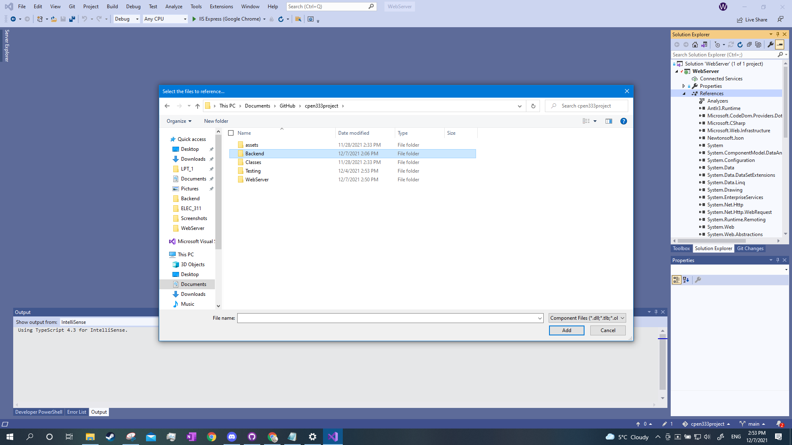
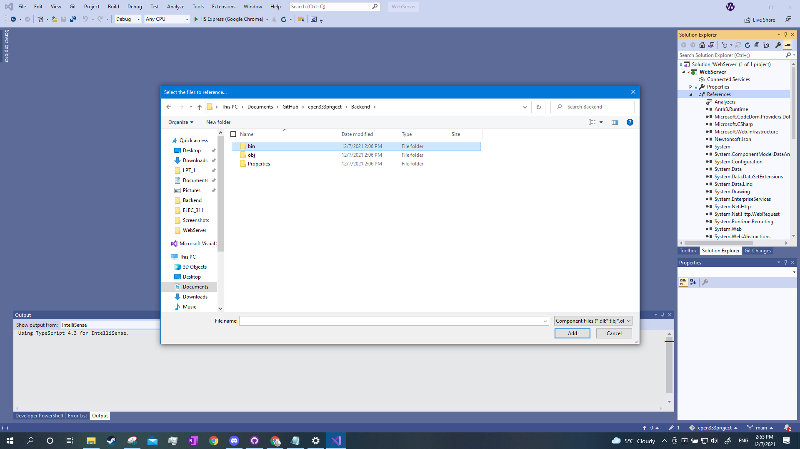
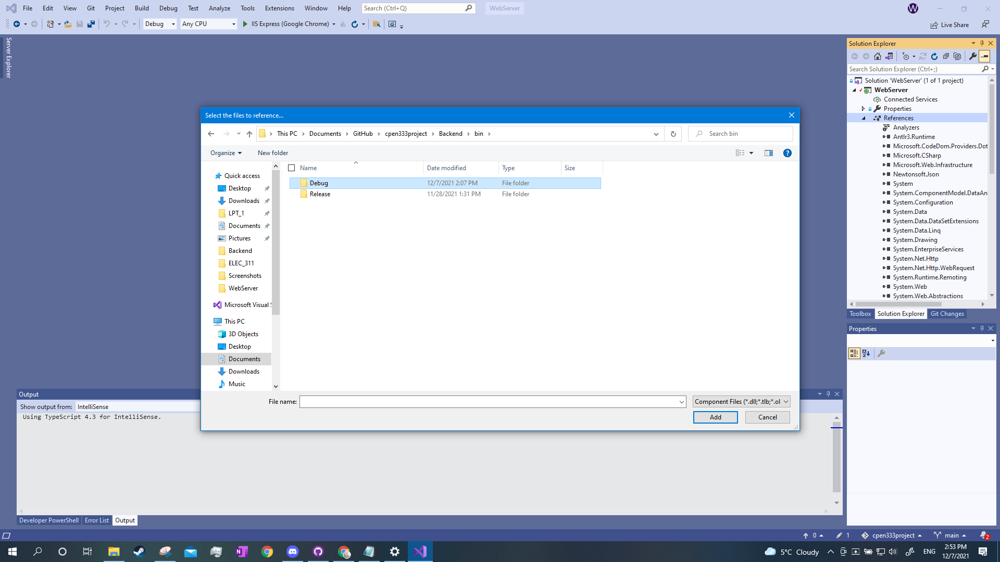
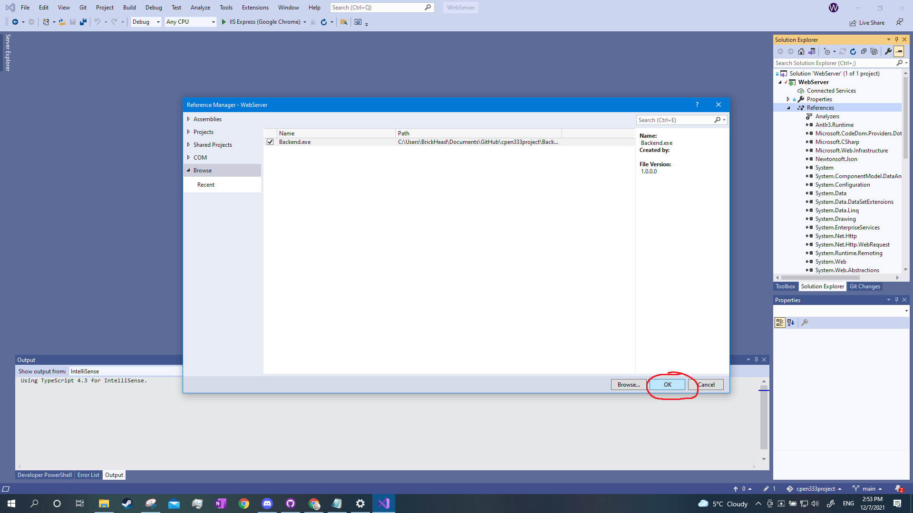

 # Amazoom: Automated Warehouse Management
Made by:  
Will Chaba   
Ahmed Tameem  
Zi Tan  
Jake An  

**READ ENTIRE README BEFORE RUNNING PROJECT**  
**NOTE: Extra features list:**  
- Warehouse Animation on backend terminal    

- Admin/Manager interactions are handled on Website using password protected page instead of on terminal. This includes:  
  - Adding/Removing Items from warehouse inventories  
  - Adding/Removing Robots from warehouses  
  - Adding new warehouse layouts  
  
- Warehouse customization is not limited to only grid size  
  - shelf layouts can be customized  

- Customer Order Page  
  - Low-Stock Alerts to encourage customers to order soon
  

# Amazoom: Set-up Tutorial

How to add reference to Backend (REQUIRED TO RUN FRONTEND)
1. Open WebServer.sln from WebServer folder
2. Open References drop-down, delete reference to Backend

3. Right click References, select Add Reference

4. Go to browse, open browse window

5. Navigate to ...\cpen333project\Backend\bin\Debug, select Backend.exe

6. click OK

# How to Run Project
1. open Backend.sln from Backend Folder
2. Open WebServer.sln from WebServer Folder
3. ENSURE REFERENCE ABOVE IS COMPLETED
4. Run Backend by pressing Start or F5
5. Run Webserver by pressing CTRL+F5
6. Use away

# Admin Page:
username: admin

password: admin

**Item Manager:**

  -Allows admins to add items to warehouse
  
  -Each item is added to a stocking order, multiple items can be added before the order is sumbitted
  
  -ENSURE VALID SHELF LOCATION, IT IS ASSUMED ADMINS HAVE A WAREHOUSE MAP ARE RESPONSIBLE ENOUGH TO DO SO
  
**Robot Manager:**

  -Allows admins to add/remove robots
  
  -use '-' in front of value to remove robots
 
**Warehouse manager:**

  -Allows Admin to add warehouses
  
  -MUST BE AT LEAT 5 COLUMNS
  
  -Example warehouse:
  
    Warehouse Name: whatever you like
    
    Rows: 5
    
    Columns: 5
    
    Shelf locations
    
    row: 1 col: 1
    
    row: 2 col: 1
    
    row: 3 col: 1
    
    row: 1 col: 3
    
    row: 2 col: 3
    
    row: 3 col: 3
    
